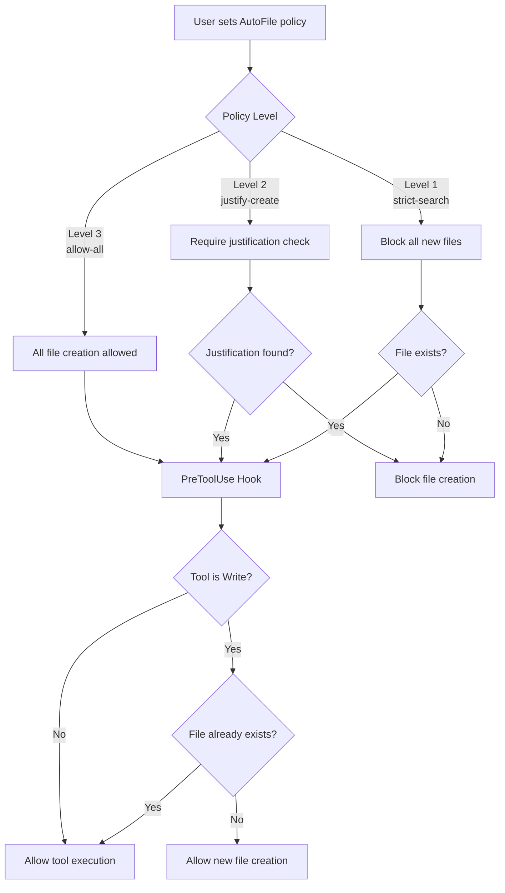
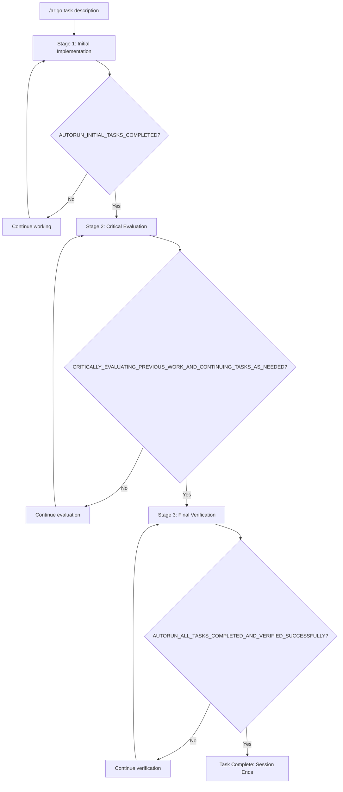

# autorun

[](https://python.org)
[](LICENSE)

## Key Features

- Tool calls pass through native safety hooks on Claude Code, Antigravity, Qwen
  Code, and Codex. Pi and OpenCode use in-process vetoes; ForgeCode receives
  advisory guidance.
- File policies control whether an agent may create files. Command guards turn
  `rm` into `trash` guidance and `git reset --hard` into `git stash` guidance.
- Stop hooks resume incomplete tasks on supported harnesses. Use
  `/ar:tasks pause <reason>` to suspend reminders and Stop enforcement without
  changing task state.
- Planning is optional. For work that needs it, autorun can critique a plan and
  run separate implementation, evaluation, and verification stages.
- The command and skill bundle includes plan export, task tracking, commit
  guidance, design principles, and session-history analysis.


## Quick Start

```bash
# Install the published package with UV. The distribution is `autorun-ai`;
# the command it installs is `autorun`, and the harness commands are `/ar:*`.
uv tool install autorun-ai
autorun --install

# Verify installation
/ar:st
# Expected: "AutoFile policy: allow-all"

# See every command in your harness's own spelling
/ar:help
```

Use as much or as little workflow structure as the task needs: keep the safety
hooks in the background, run a task directly, or add planning for larger work.

**Optional planning and execution:**

```bash
/ar:go Build a login form with tests    # Run directly with three-stage verification

/ar:plannew Design a REST API with authentication and tests
/ar:planrefine                          # Critique and improve the plan
/ar:planprocess                         # Execute the plan
```

**File Policy** (prevent file clutter):

```bash
/ar:f                    # Strict: only modify existing files
/ar:j                    # Justify: require justification for new files
/ar:a                    # Allow: create files freely (default)
```

**Safety**:

```bash
/ar:sos                  # Emergency stop
```

> Works with **Claude Code**, **Google Antigravity**, **Qwen Code**, **Codex CLI**, **Pi**, **ForgeCode**, and **OpenCode**. Legacy **Gemini CLI** support remains explicit opt-in — see [Multi-CLI Support](#multi-cli-support).

> Examples use Claude/Gemini slash commands. In Codex, use the same command without the leading slash, such as `ar:st` or `ar:ok git push`. Every harness that receives your prompt also accepts the other spellings: [Command Spellings by Harness](#command-spellings-by-harness).

**Self-Improvement** (learn from past sessions):

```bash
aise skills run corrections --when 30d --limit 50  # Find recurring AI mistakes
aise analyze --when 30d --output /absolute/new/analysis
# Install AI Session Search separately; see https://github.com/ahundt/ai-session-search
```

## Table of Contents

- [Key Features](#key-features)
- [Quick Start](#quick-start)
- [UV Installation](#uv-installation-recommended)
  - [Multi-CLI Support](#multi-cli-support)
- [What autorun Does For You](#what-autorun-does-for-you)
- [Why Byobu + tmux Integration](#why-byobu--tmux-integration)
- [AutoFile Lifecycle Flow](#autofile-lifecycle-flow)
- [How It Works](#how-it-works)
  - [Three-Stage Autorun System](#three-stage-autorun-system)
- [Tmux Integration](#tmux-integration)
- [Development](#development)
- [Available Commands](#available-commands)
  - [Command Spellings by Harness](#command-spellings-by-harness)
  - [AutoFile (File Creation Control)](#autofile-file-creation-control)
  - [Command Redirecting](#command-redirecting)
  - [Autorun Commands (Autonomous Execution)](#autorun-commands-autonomous-execution)
  - [Plan Management Commands](#plan-management-commands)
  - [Task Lifecycle Tracking](#task-lifecycle-tracking)
  - [Documentation Commands](#documentation-commands)
  - [Tmux Automation Commands](#tmux-automation-commands)
  - [Usage Examples](#usage-examples)
- [CLI Reference](#cli-reference)
- [Plugin Architecture and Integration Guide](#plugin-architecture-and-integration-guide)
- [Tmux Automation Agents](#tmux-automation-agents)
- [Project Structure](#project-structure)
- [Developer Documentation](#developer-documentation)
- [Dependencies](#dependencies)
- [Companion Tools](#companion-tools)
- [Troubleshooting](#troubleshooting)
- [Contributing and Sharing](#contributing-and-sharing)
- [References](#references)
- [License](#license)

## UV Installation (Recommended)

The source marketplace includes **autorun** and **pdf-extractor**. The standalone
autorun Python distribution embeds only the `ar` plugin's harness assets;
install the pdf-extractor plugin from the Claude marketplace or a source
checkout. Its extraction code needs no separate package — see below.

> **Note:** plan-export functionality is now built into the autorun plugin. Use `/ar:planexport` commands for plan management.

### Python package installation

`autorun` is the only published distribution. Install a release from PyPI:

```bash
uv tool install autorun-ai
autorun --install
```

PDF extraction ships inside it. `extract-pdfs` is always present, and every
extraction backend is optional, so nobody who never opens a PDF downloads one:

```bash
uv tool install --force 'autorun-ai[pdf]'
extract-pdfs --list-backends
```

### GitHub installation

Install the current autorun Python distribution directly from its repository
subdirectory:

```bash
# Install the CLI and complete embedded plugin
uv tool install 'git+https://github.com/ahundt/autorun.git#subdirectory=plugins/autorun'

# Register plugins with Claude Code
autorun --install
```

Claude Code can alternatively use the repository marketplace directly:

```bash
claude plugin marketplace add https://github.com/ahundt/autorun.git
claude plugin install ar@autorun
```

### Local Installation

Install from a local clone:

```bash
# Clone repository
git clone https://github.com/ahundt/autorun.git
cd autorun

# Install the autorun tool
uv tool install --editable plugins/autorun

# Register plugins with Claude Code
autorun --install
```

> **Note:** `autorun --install` publishes native assets from the installed
> distribution. `autorun --install --install-dry-run` previews the same walk.

### Development Installation

For contributors and developers:

```bash
# Clone repository
git clone https://github.com/ahundt/autorun.git
cd autorun

# Option 1: UV (recommended; faster dependency management)
uv run --project plugins/autorun python -m autorun --install --force

# Option 2: pip fallback (if UV is unavailable)
python -m pip install -e plugins/autorun && autorun --install --force

# REQUIRED: Install as UV tool for global CLI availability
# This makes 'autorun' and 'autorun-install' globally available
cd plugins/autorun && uv tool install --force --editable .

# Verify installation
autorun --status  # Verifies UV tool installation works
```

**Install UV (if needed):**
```bash
# macOS/Linux:
curl -LsSf https://astral.sh/uv/install.sh | sh

# Homebrew:
brew install uv

# Windows:
powershell -c "irm https://astral.sh/uv/install.ps1 | iex"
```

### Verification

After installation, verify plugins are registered:

```bash
# Check installed plugins
claude plugin marketplace list

# See all available commands
/help

# Test autorun
/ar:st
# Expected: "AutoFile policy: allow-all"
```

### Multi-CLI Support

**autorun defaults to Claude Code, Google Antigravity, Qwen Code, Codex CLI, Pi, Prime Agent, ForgeCode, and OpenCode**, providing shared safety features, command handlers, and autonomous execution capabilities across maintained harnesses. Legacy Gemini CLI support remains available only through explicit `--gemini` selection.

#### Codex CLI Support

Autorun installs Codex hooks at `~/.codex/hooks.json` by default and exposes its skill bundle as a local Codex plugin through `~/.agents/plugins/marketplace.json` with source `~/plugins/autorun`. After install, run `/hooks` inside Codex if prompted so Codex trusts the hook hashes. Codex task progress maps to the native `update_plan` checklist tool, search/file-discovery guidance uses shell `rg -n` and `rg --files`, and file edits use `apply_patch`.

Codex loads matching hooks from every active source, including user config and plugin bundles. Autorun therefore makes the hook source explicit during installation:

```bash
autorun --install --codex --codex-hook-source user    # default: ~/.codex/hooks.json only
autorun --install --codex --codex-hook-source plugin  # ar@personal bundled hooks only
autorun --install --codex --codex-hook-source both    # install both sources intentionally
autorun --install --codex --codex-hook-source none    # remove autorun Codex hooks, keep skills/guidance
autorun --install --codex --codex-plugin-marketplace github
                                                        # install plugin from ahundt/autorun as ar@autorun
```

`AUTORUN_CODEX_HOOK_SOURCE` can set the same mode for unattended reinstalls. Reinstalls refresh the selected Codex plugin (`ar@personal` or `ar@autorun`) so changing modes clears stale hook files from previous cache versions instead of leaving duplicate PreToolUse/PostToolUse hooks behind.

`ar@personal` is the local development plugin identity: `ar` is the plugin name, the same one every harness registers, and `personal` is the generated local marketplace name in `~/.agents/plugins/marketplace.json`. For repo-backed Codex installs, the repository ships `.agents/plugins/marketplace.json` with marketplace name `autorun` and display name `Autorun`; use `--codex-plugin-marketplace github` to add `ahundt/autorun` through `codex plugin marketplace add` and install `ar@autorun`. An install made before the plugin was renamed removes its own `autorun` entry, so the marketplace lists one entry per product.

Codex may intercept unknown slash commands before hooks see them, so use `ar:*` or `ar <command>` forms in Codex, such as `ar:st` or `ar:ok git push`. Autorun skills use Codex's native skill surfaces: run `/skills`, mention the skill as `$mermaid-diagrams`, or select the installed `@autorun` plugin. Codex does not turn arbitrary skills into slash commands such as `/mermaid`.

#### Choosing where skills are installed

An install writes several harnesses at once, and each one should end up with a
skill by exactly one route. `--skill-placement` decides that route:

```bash
autorun --install                                     # auto (default)
autorun --install --skill-placement native            # never use ~/.agents/skills
autorun --install --skill-placement both              # shared AND native where supported
autorun --install --skill-placement native --skill-placement codex=both
```

| Mode | Effect |
|---|---|
| `auto` | One route per harness: the shared `~/.agents/skills` root for harnesses whose docs describe reading it (Codex, legacy Gemini, Qwen Code, Pi, Prime Agent, ForgeCode, and OpenCode), otherwise that harness's native plugin/extension skills directory. |
| `native` | Native route only. Nothing is written to the shared root. |
| `both` | Shared **and** native where the harness reads both. The only mode that can list one skill twice, after which the two copies can drift apart. |

A bare mode applies to every selected harness; `HARNESS=MODE` overrides one, and
the flag repeats. Valid harness names are `antigravity`, `claude`, `codex`,
`forgecode`, `gemini`, `opencode`, `pi`, `prime`, and `qwen`. An unknown harness
or mode is rejected at parse time with the list of valid names.

`AUTORUN_SKILL_PLACEMENT` accepts the same grammar, space- or comma-separated
(`AUTORUN_SKILL_PLACEMENT="native codex=both"`), and the `skill_placement`
config key accepts either a mode string or a mapping of harness to mode with an
optional `default` key. Precedence is flag > environment > config > `auto`. A
bad value in the environment or config is ignored rather than aborting the
install; a bad flag value fails immediately.

Run `autorun --install-dry-run` to print the resolved mode, where it came from,
and the exact directories each harness would receive, before anything is written.

#### Sharing skills with Claude Code

Codex, OpenCode, Pi, Prime Agent, ForgeCode, Qwen Code, and legacy Gemini CLI all scan `~/.agents/skills/`, the cross-tool shared location. Claude Code does not — it reads `~/.claude/skills/` only. A skill authored in the shared directory is therefore invisible to Claude Code until it is bridged:

```bash
autorun --install --claude --claude-agents-skills link  # symlink shared skills into ~/.claude/skills
autorun --install --claude --claude-agents-skills copy  # copy instead (Windows without Developer Mode)
autorun --install --claude --claude-agents-skills none  # default: leave ~/.claude/skills untouched
```

`AUTORUN_CLAUDE_AGENTS_SKILLS` sets the same mode for unattended installs; the flag wins over the environment variable.

The default is `none` so no install silently rewrites your skills directory. Skills a plugin already provides are skipped, because Claude Code deduplicates by resolved path rather than by name — a plugin copy and a shared copy are different paths, so both would appear in the skill listing. Existing directories are never replaced.

Individual skill directories are linked rather than the whole `skills/` folder: Claude Code stops loading user skills entirely when that directory is itself a symlink ([anthropics/claude-code#38051](https://github.com/anthropics/claude-code/issues/38051)), so autorun refuses that layout with an explanation instead of writing something that would never load. Discovery is top level only ([#18192](https://github.com/anthropics/claude-code/issues/18192)), so links are flat. Restart Claude Code after bridging for new skills to appear.

`autorun --uninstall` removes only the links it created; a real directory that happens to share a name, and links pointing anywhere else, are left alone.

The shared location is configurable through `shared_agents_dir` and `shared_agents_skills_subdir` in `CONFIG`, which install and uninstall both read.

#### Bundled skill examples

An install selects skills from the chosen `plugins/*/skills/` trees and uses the
harness's native skill picker or mention syntax. The table lists common examples. In Codex, use `/skills` or `$skill-name`; do not
assume a skill is an `/ar:*` command. The read-only
`autorun --capability-snapshot` output is the machine-readable inventory.

| Skill | Purpose |
|-------|---------|
| `cache` | Configure cache-miss and compaction protection |
| `ai-skill-builder` | Create and review portable Agent Skills |
| `cli-demo-recorder` | Record reproducible CLI and TUI demos |
| `mermaid-diagrams` | Render Mermaid diagrams |
| `parallel-subagent` | Investigate ambiguous failures with parallel approaches |
| `pdf-extractor` | Extract text and structured data from PDFs with backend fallback |
| `tmux-automation` | Automate isolated terminal and harness tests |

Claude, Gemini, Qwen, and Antigravity discover the skill through their native
per-plugin installation. Codex receives the union of selected plugin skills in
`~/.agents/skills/`, so `$pdf-extractor` works independently of the autorun
plugin cache. Pi consumes the shared installation through `/skill:<name>` and
can also use `~/.pi/agent/skills/` when `--skill-placement native` is selected.
ForgeCode and OpenCode use their model-facing skill tools; neither exposes an
autorun-writable native skill directory, so `native` installs no skills for
those two harnesses while `auto` and `both` use the shared route.

For hook schema details, see [docs/codex-cli-hooks-api.md](docs/codex-cli-hooks-api.md).

#### Legacy Gemini CLI Requirements (Explicit Opt-In)

**Version**: Gemini CLI v0.28.0 or later (hooks require explicit enablement)

**Required Settings**: Edit `~/.gemini/settings.json` and add:

```json
{
  "tools": {
    "enableHooks": true,
    "enableMessageBusIntegration": true
  }
}
```

**Update Gemini CLI**:

```bash
# Using Bun
bun install -g @google/gemini-cli@latest

# Or using npm
npm install -g @google/gemini-cli@latest

# Verify version
gemini --version  # Should show 0.28.0 or later
```

For troubleshooting, see [TROUBLESHOOTING.md](plugins/autorun/TROUBLESHOOTING.md).

#### Legacy Gemini CLI Installation

```bash
# Clone and install
git clone https://github.com/ahundt/autorun.git && cd autorun

# Option 1: UV (recommended)
uv run --project plugins/autorun autorun --install --gemini --force
uv run --project plugins/autorun autorun --restart-daemon

# Option 2: pip fallback
python -m pip install -e plugins/autorun && \
autorun --install --gemini --force && \
autorun --restart-daemon

# Verify installation
gemini extensions list
autorun --status --gemini
# Should show: ar@1.0.0rc1

# Test in Gemini CLI
gemini
/ar:st
# Expected: "AutoFile policy: allow-all"
```

#### Pi support

Pi loads autorun from `~/.pi/agent/extensions/ar/`. The TypeScript adapter sends
`tool_call`, prompt, result, session, and `agent_settled` events to the same
Python daemon used by the other harnesses. A denied tool returns Pi's native
`{ block: true, reason }` result. When autorun rejects the settle boundary, the
adapter sends a hidden `autorun-continuation` custom message that starts the
next turn without attributing extension text to the user. Pi also receives
sequential `TaskCreate`, `TaskUpdate`, `TaskList`, and `TaskGet` tools backed by
the same Python task lifecycle and session state as other harnesses.

```bash
autorun --install --pi --force
pi
/ar st
```

Pi also accepts `ar:st`, `ar-st`, and `/ar:st`. Skills use Pi's native
`/skill:<name>` command and the shared `~/.agents/skills/` installation.
Development tests must redirect `HOME`, `PI_CODING_AGENT_DIR`, `AUTORUN_HOME`,
and `AUTORUN_TEST_STATE_DIR` before importing or installing autorun.

The gate covers model tool calls only. Two Pi paths run without it: a `!`
shell line you type yourself is not a tool call, and a Pi process started with
`--no-extensions` never loads the adapter. `pi-subagents` passes
`--no-extensions` to a child `pi` when the agent definition declares its own
`extensions:` list (or a capability ceiling denies extensions), so add
`~/.pi/agent/extensions/ar/index.ts` (`~/.prime/agent/extensions/ar/index.ts`
under Prime Agent) to that list to keep the guard in the child. Agents without
an `extensions:` key inherit it automatically.

Pi task tools use the same Python-owned lifecycle as Claude: `TaskCreate`,
`TaskList`, and `TaskGet` provide create/read operations; `TaskUpdate` accepts
one `taskId` or an atomic `taskUpdates` array, including `addBlockedBy` and
`addBlocks`; `status="deleted"` is the delete operation.

#### Qwen Code Support

Qwen Code uses a Gemini-derived extension surface (`qwen extensions install`, `qwen extensions list`, and extension hooks). Autorun reuses the Gemini extension template but rewrites installed Qwen hook commands to `--cli qwen`, so Qwen sessions get Qwen-specific detection and response handling while commands and skills stay single-owned.

```bash
brew install qwen-code
autorun --install --qwen --force
qwen extensions list
```

For Z.AI GLM-5.2 through Qwen Code, use Qwen's OpenAI-compatible auth path
and the Z.AI coding-plan endpoint:

```bash
OPENAI_BASE_URL="https://api.z.ai/api/coding/paas/v4" \
OPENAI_API_KEY="$Z_AI_AUTH_TOKEN" \
OPENAI_MODEL="${Z_AI_MODEL:-glm-5.2}" \
qwen --auth-type openai --model "${Z_AI_MODEL:-glm-5.2}"
```

The local Claude aliases can keep using `ANTHROPIC_AUTH_TOKEN` and
`Z_AI_BASE_URL=https://api.z.ai/api/anthropic`; Qwen's verified GLM-5.2 route
maps the same `Z_AI_AUTH_TOKEN` secret to `OPENAI_API_KEY` instead.

#### Multi-Model Workflows

Use autorun's safety features across supported CLIs:

```bash
# Claude Code creates implementation
claude
/ar:go "Implement user authentication system"

# Gemini CLI reviews with vision capabilities
gemini
"Review the authentication code and analyze this architecture diagram"
# Attach: architecture.png

# All sessions use autorun safety:
# - File policies enforce consistently
# - Command blocking prevents dangerous operations
# - Sessions are isolated (no state leakage)
```

#### Gemini-Specific Features

**Vision + Safety**: Analyze images/diagrams with autorun safety guards active:

```bash
gemini -i screenshot.png -c "Convert this UI mockup to React components"
```

Autorun ensures generated code respects file policies (`/ar:f` for strict mode) and blocks dangerous operations.

**Cross-Model Code Review**: Use Gemini to review Claude's work with safety features active:

```bash
# After Claude creates code
gemini -c "Review src/auth.py for security issues and suggest improvements"
# File policies and command redirecting stay active during review
```

#### Installation Notes

1. **Single install command**: `autorun --install` detects supported CLIs and installs for whichever are present
2. **Same handlers**: Autorun and pdf-extractor commands use the same backing behavior across supported CLIs
3. **Isolated sessions**: Supported CLI sessions don't interfere with each other
4. **Shared safety**: File policies, command redirecting, and hooks work consistently across supported CLIs

For more details, see [GEMINI.md](GEMINI.md) for Gemini-specific usage patterns.

## What autorun Does For You

| Problem | autorun Solution |
|---------|-----------------|
| Claude stops mid-task, requiring manual "continue" | **Automatic continuation** — hooks detect incomplete work and re-inject the task |
| AI claims "done" with partial implementation | **Implement, evaluate, verify** before session ends. Reduces premature exits |
| AI creates dozens of experimental files | **File policy control** — strict search (`/ar:f`), justified creation (`/ar:j`), or allow all (`/ar:a`) |
| Dangerous commands run without warning | **Command redirecting** — blocks `rm`, `git reset --hard`, etc. and suggests safer alternatives |
| Terminal crash loses all progress | **Session persistence** — [tmux](https://github.com/tmux/tmux)/[byobu](https://www.byobu.org/) keeps sessions alive across crashes, reboots, and network drops |
| Must be at workstation to monitor AI | **Work from anywhere** — access sessions remotely via SSH/[Mosh](https://mosh.org/) from any device |

### Testing

```bash
# Quick core tests
uv run --project plugins/autorun pytest plugins/autorun/tests/test_unit_simple.py -v

# Full suite with coverage
uv run --project plugins/autorun pytest plugins/autorun/tests/ --cov=plugins/autorun/src/autorun --cov-report=term-missing
```

**Integration test**: Create a byobu session (`byobu-new-session autorun-work`), run `/ar:go <task>`, close terminal, reattach (`byobu-attach autorun-work`) — AI work should continue from where it left off.

## Why Byobu + tmux Integration

**autorun is designed for use with [byobu](https://www.byobu.org/)** (tmux wrapper) for session persistence, remote access, and multi-pane monitoring:

1. **Survive failures**: Sessions persist through crashes, reboots, and network drops — SSH back and resume exactly where you left off
2. **Work from anywhere**: Access sessions from any device via SSH/Mosh (see [References](#references) for client recommendations)
3. **Multi-pane monitoring**: Split terminal into panes for AI output, error logs, file system monitoring, and command history simultaneously

## AUTOFILE LIFECYCLE FLOW



**Policy Level 1: Strict Search** (`/afs`)
- Blocks all new file creation via PreToolWrite hooks
- Forces AI to modify existing files after platform-native search (`Glob`/`Grep` on Claude, `glob`/`grep_search` on Gemini, `rg --files`/`rg -n` on Codex)
- Ideal for refactoring established codebases
- Prevents pollution with experimental files

**Policy Level 2: Justify Create** (`/afj`)
- Requires `<AUTOFILE_JUSTIFICATION>` tag in AI reasoning
- Hook scans transcript for proper justification before allowing new files
- Balances innovation with organization
- Records why each file was created in reasoning

**Policy Level 3: Allow All** (`/afa`)
- No restrictions on file creation (default for new projects)
- Full creative freedom for initial development
- Best for prototyping and new project setup
- All tools pass through without intervention

## How It Works

### Three-Stage Autorun System



**Stage 1: Initial implementation.** Claude works on the task and outputs `AUTORUN_INITIAL_TASKS_COMPLETED` when done.

**Stage 2: Critical evaluation.** Claude evaluates the work, identifies gaps, and outputs `CRITICALLY_EVALUATING_PREVIOUS_WORK_AND_CONTINUING_TASKS_AS_NEEDED` when satisfied.

**Stage 3: Final verification.** Claude checks the requirements and outputs `AUTORUN_ALL_TASKS_COMPLETED_AND_VERIFIED_SUCCESSFULLY` to finish.

**Emergency Stop**: At any point, `/ar:sos` outputs `AUTORUN_STATE_PRESERVATION_EMERGENCY_STOP` and immediately halts.

**Hook mechanism**: User sends `/ar:go <task>` → UserPromptSubmit hook activates stage tracking → AI works autonomously → system validates completion markers at each stage boundary (implement, evaluate, verify) → session ends only after all stages complete.

### Safety Mechanisms
- **Maximum recheck limit**: Prevents infinite loops (default: 3 attempts per stage)
- **Emergency stop**: `/ar:sos` immediately terminates any runaway process
- **Plan acceptance**: Plans can auto-trigger autorun via "PLAN ACCEPTED" marker
- **State validation**: Ensures session integrity throughout process

### Verification Example

**Before autorun**: Claude stops after implementing basic login form
**With autorun (implement, evaluate, verify)**:
1. Stage 1: "Login form implemented!" → `AUTORUN_INITIAL_TASKS_COMPLETED`
2. Stage 2: "Critically evaluated; added error handling; tests missing" → continues working → `CRITICALLY_EVALUATING_PREVIOUS_WORK_AND_CONTINUING_TASKS_AS_NEEDED`
3. Stage 3: "Verified: Form works, tests pass, error handling complete" → `AUTORUN_ALL_TASKS_COMPLETED_AND_VERIFIED_SUCCESSFULLY` → Session ends

## Tmux Integration

For crash-safe sessions that survive disconnections, use [byobu](https://www.byobu.org/) (recommended tmux wrapper). Install: `brew install byobu` (macOS), `sudo apt install byobu` (Linux).

```bash
# Create session, start autonomous work, detach
byobu-new-session autorun-work
/ar:go Build a complete web application with authentication
# Detach: Ctrl+A, D (or close terminal)

# Reattach from anywhere (SSH/Mosh)
byobu-attach autorun-work
```

**Why byobu over raw tmux?** Simpler keybindings, status bar, session persistence out of the box:
- **F3/F4** — switch between tabs (windows)
- **Ctrl+A, D** — detach (session keeps running)
- **`byobu-attach autorun-work`** — reattach from any terminal/device
- **F1** — help with all shortcuts

More: [byobu docs](https://www.byobu.org/documentation), [Mosh](https://mosh.org/) for mobile connections, [SSH/Mosh clients](#references) by platform.

## Development

1. **Edit source**: `plugins/autorun/src/autorun/` in the git repository (NOT the plugin cache at `~/.claude/plugins/cache/`)
2. **Run tests**: `uv run --project plugins/autorun pytest plugins/autorun/tests/ -v`
3. **Reinstall after changes**: See [Development Installation](#development-installation-contributors)
4. **Update plugin**: `/plugin update ar@autorun`

## Advanced Setup (Optional)

### Development Installation (Contributors)

For contributing to autorun development:

```bash
# Clone repository
git clone https://github.com/ahundt/autorun.git
cd autorun

# Install plugin + UV tool + restart daemon (one-liner)
(uv run --project plugins/autorun python -m autorun --install --force && \
  cd plugins/autorun && \
  uv tool install --force --editable . && \
  cd ../.. && \
  autorun --restart-daemon) 2>&1 | tee "install-$(date +%Y%m%d-%H%M%S).log"
```

**Contributor Workflow:**
1. **Make changes**: Edit code in your local clone
2. **Test locally**: Use the installed development version to test your changes
3. **Run tests**: `uv run --project plugins/autorun pytest plugins/autorun/tests/` to ensure nothing breaks
4. **Submit PR**: Create a pull request with your improvements

**AI Safety with Git:**
- **Undo last commit**: `git reset --soft HEAD~1` undoes commit, keeps changes staged
- **Stash changes**: `git stash` temporarily shelves changes, `git stash pop` restores
- **Restore a file**: `git restore filename` reverts specific file to last commit
- **Change visibility**: `git diff` shows exactly what was modified before committing

### Manual Installation (if plugin system fails)

```bash
# Option 1: UV (recommended)
uv run --project plugins/autorun python -m autorun --install --force

# Option 2: pip fallback (if UV not available)
python3 -m venv .venv
source .venv/bin/activate
python -m pip install -e plugins/autorun
python -m autorun --install --force
```

## Available Commands

- **Project/Repo name**: `autorun`
- **Marketplace name**: `autorun` (used for `/plugin install ar@autorun`)
- **Command prefix**: `ar` (short forms like `/ar:st` for speed, long forms like `/ar:status` for discoverability)
- **Live list**: `/ar:help` prints every command with its description, `/ar:help <command>` prints one command's arguments, and typing `ar` alone opens the same list

### Command Spellings by Harness

The grammar is `ar:<command> [arguments]` everywhere. Harnesses differ only in
which spellings they hand to autorun.

| You type | Claude Code, Antigravity, Qwen Code | Pi, Prime Agent | Codex CLI | ForgeCode, OpenCode |
|---|---|---|---|---|
| `/ar:st` | runs, and appears in the slash menu | runs | never arrives | never arrives |
| `ar:st`, `ar st`, `ar-st` | runs | runs | runs | never arrives |
| `/ar-st` | never arrives — the harness answers with its own unknown-command message | runs | never arrives | runs, for the installed files named below |
| `ar:task-status`, `ar:task-ignore`, under any prefix above | runs as `ar:task status` and `ar:task ignore` | same | same | never arrives |

"Never arrives" means the harness itself keeps the text: Codex holds its own
slash menu closed, Claude Code and Qwen Code consume an unknown slash command
in their own slash processors and print their own feedback ("Unknown skill"
on Claude, "Unknown command" on Qwen — verified in both harnesses' source, so
you always see an immediate error rather than a silent drop), and ForgeCode
sends autorun no hook events. ForgeCode's installed guards are
advice to the agent. OpenCode does not expose prompt or Stop hooks, but its
in-process JavaScript bridge sends tool calls to autorun, vetoes denied
commands, and mirrors OpenCode's native todo list (`todo.updated`) into
autorun's task status. On both harnesses the installed files `ar-go`, `ar-st`, `ar-allow`,
`ar-find`, `ar-commit`, and `ar-ph` are the command surface.

Autorun prints the local spelling everywhere: `/ar:` on Claude Code and the
Gemini family, `/ar ` on Pi, `ar:` on Codex, and `/ar-` on ForgeCode and OpenCode. `/ar:help`
opens with the rule for the harness you are on.

| Short | Long | Legacy | Description |
|-------|------|--------|-------------|
| - | `/ar:help` | - | List every command and what it does, in this harness's spelling |
| `/ar:a` | `/ar:allow` | `/afa` | Allow all file creation (Level 3) |
| `/ar:j` | `/ar:justify` | `/afj` | Require justification for new files (Level 2) |
| `/ar:f` | `/ar:find` | `/afs` | Find existing files only; no creation (Level 1) |
| `/ar:st` | `/ar:status` | `/afst` | Show current policy status |
| `/ar:go` | `/ar:run` | `/autorun` | Start autonomous task execution |
| `/ar:gp` | `/ar:proc` | `/autoproc` | Procedural autonomous workflow |
| `/ar:task` | `/ar:tasks` | - | Show task status or dispatch pause, resume, ignore, prompts, and recovery |
| `/ar:gc` | `/ar:commit` | - | Display Git Commit Requirements (17-step process) |
| `/ar:ph` | `/ar:philosophy` | - | Display Universal System Design Philosophy (17 principles) |
| `/ar:pn` | `/ar:plannew` | - | Create new structured plan |
| `/ar:x` | `/ar:stop` | `/autostop` | Graceful stop |
| `/ar:sos` | `/ar:estop` | `/estop` | Emergency stop |
| `/ar:pr` | `/ar:planrefine` | - | Refine and improve existing plan |
| `/ar:pu` | `/ar:planupdate` | - | Update plan with new information |
| `/ar:pp` | `/ar:planprocess` | - | Execute plan with development process |
| `/ar:tm` | `/ar:tmux` | - | Tmux session management |
| `/ar:tt` | `/ar:ttest` | - | Tmux test workflow |
| `/ar:tabs` | - | - | Discover and manage Claude sessions across tmux |
| `/ar:no <p>` | - | - | Block command pattern in session |
| `/ar:ok <p> [N\|5m\|perm]` | - | - | Allow pattern — `3` uses, `5m` duration, or `perm` (rest of session); default 1 use then auto-revokes |
| `/ar:clear` | - | - | Clear all session blocks and allows |
| `/ar:globalno <p>` | - | - | Block command pattern globally (persists across sessions) |
| `/ar:globalok <p> [N\|5m\|perm]` | - | - | Allow pattern globally — `3` uses, `5m` duration, or `perm` (until cleared); default 1 use then auto-revokes |
| `/ar:blocks` | - | - | Show active session-level blocks and allows |
| `/ar:globalstatus` | - | - | Show global blocks and allows |
| `/ar:globalclear` | - | - | Clear all global blocks and allows |
| `/ar:reload` | - | - | Reload integration rules from config files |
| `/ar:restart-daemon` | - | - | Restart the daemon for the current autorun install/source tree |
| `/ar:task` | `/ar:tasks` | - | Show pause, prompting, recovery, and tracked-task status |
| `/ar:task pause [N] [duration] [reason]` | - | - | Bare pause defaults to five minutes; reason-only pauses until AI recovery; explicit scopes may be combined |
| `/ar:task resume` | - | - | Resume task enforcement explicitly |
| `/ar:task ignore <id> [reason]` | - | - | Mark one task ignored so it no longer blocks Stop |
| `/ar:task prompts on\|off\|<N>\|initial N\|subsequent N\|scope all/user/subagent` | - | - | Configure task-staleness prompting |
| `/ar:task recovery on\|off\|min <N>` | - | - | Configure repeated-Stop stale-task recovery |
| `/ar:cache` | - | - | Cache-miss / compaction protection gate (off by default) — show status |
| `/ar:cache on [5m\|1h\|perm]` | - | - | Enable the gate (optionally for a window) |
| `/ar:cache off [5m\|1h\|perm]` | - | - | Disable the gate (optionally temporarily, prior state restores) |
| `/ar:cache set ratio\|read\|age\|full <v>` | - | - | Configure threshold axes (tokens `50k\|.5M`, `85%`, durations `5m\|2h30m\|2d`) |
| `/ar:cache ok [5m\|N\|perm]` | - | - | Override the gate — same grammar as `/ar:ok` |
| `/ar:cache no` | - | - | Cancel outstanding overrides |
| `/ar:cache global <subcmd>` | - | - | Same operations at the global (cross-session) scope |
| `/ar:pe` | `/ar:planexport` | - | Show plan export status (effective state and which layer set it) |
| `/ar:pe on\|off` | `/ar:planexport on\|off` | - | Pin plan export for the current project (pin beats the global default) |
| `/ar:pe globalon\|globaloff` | `/ar:planexport globalon\|globaloff` | - | Set the global default for every project |
| `/ar:pe dir <path>` | `/ar:planexport dir <path>` | - | Set the export directory (template variables allowed) |
| `/ar:pe pattern <template>` | `/ar:planexport pattern <template>` | - | Set the filename pattern |
| `/ar:pe <component> [on\|off\|dir <path>]` | `/ar:planexport <component> […]` | - | Per-component switch and destination. Components are `accepted` and `rejected`; a bare name toggles it. A component writes only when both plan export and that component are on |
| `/ar:pe reset` | `/ar:planexport reset` | - | Restore defaults (also clears project pins) |
| `/ar:tabw` | - | - | Cross-window session actions |
| `/ar:gemini` | - | - | Gemini CLI reference guide |
| `/ar:test` | - | - | Test command guidelines |
| `/ar:marketplace-test` | - | - | Run marketplace tests |

### AutoFile (File Creation Control)

Three-tier policy system enforced via PreToolUse hooks:
- **Level 3** `/ar:a` — Allow all (default). Best for new projects
- **Level 2** `/ar:j` — Require `<AUTOFILE_JUSTIFICATION>` tag. For established codebases
- **Level 1** `/ar:f` — Block all new files, force search-and-modify. For refactoring

### Command Redirecting

**General-purpose command redirecting with actionable suggestions** — When a dangerous command is blocked, autorun doesn't just say "no" — it suggests a safer alternative (e.g., `rm` → `trash`, `git reset --hard` → `git stash`). This is one of autorun's most important safety features. Block commands per-session or globally.

**Session Commands:**
- **/ar:no \<pattern> [description]** - Block pattern in this session
- **/ar:ok \<pattern> [N|5m|permanent]** - Allow pattern — `3` uses, `5m` duration, or `permanent` (rest of session); default 1 use then auto-revokes
- **/ar:clear** - Clear all session blocks and allows
- **/ar:blocks** - Show active session-level pattern blocks and allows
- **/ar:status** - Show AutoFile policy, session and global blocks/allows

**Global Commands:**
- **/ar:globalno \<pattern> [description]** - Block pattern globally (all sessions)
- **/ar:globalok \<pattern> [N|5m|permanent]** - Allow pattern globally — `3` uses, `5m` duration, or `permanent` (until cleared); default 1 use then auto-revokes
- **/ar:globalstatus** - Show global blocks
- **/ar:globalclear** - Clear all global pattern blocks and allows

**Developer/Admin Commands:**
- **/ar:reload** - Force-reload all integration rules from config files
- **/ar:restart-daemon** - Restart the daemon for the current autorun install/source tree
- **autorun --restart-all-daemons** - Risky recovery command for stale or mixed-version daemons; can interrupt active autorun-backed sessions in other installs
- **autorun --state-status** - Report the configured state backend, whether a conversion to the row-based store has run, and how many fields it moved
- **autorun --state-migrate** - Convert existing JSON state while the scoped daemon is stopped; required before selecting SQLite when legacy state exists
- **autorun --state-rollback** - Export state from the row-based store back to `daemon_state.json`, so `state_backend` can be set to `json` again without losing anything written since the conversion
- **autorun --state-maintenance** - Report SQLite database, WAL, and reclaimable bytes without deleting state

**Pattern Type Prefixes:**
- **regex:\<pattern>** - Use regular expression matching
- **glob:\<pattern>** - Use glob pattern matching
- **/\<pattern>/** - Auto-detects regex when pattern contains metacharacters
- *(default)* - Literal substring matching

**Examples:**
```bash
# Basic blocking (uses DEFAULT_INTEGRATIONS for suggestions)
/ar:no rm

# Custom description for specific guidance
/ar:no "exec(" unsafe exec function: use alternatives

# Regex pattern matching for flexible patterns
/ar:no regex:eval\( dangerous eval usage: blocked for security

# Glob pattern matching for wildcards
/ar:no glob:*.tmp temporary files are not allowed in this session

# Global blocking with custom description
/ar:globalno "git reset --hard" PERMANENTLY DESTRUCTIVE: use git restore instead

# Auto-detect regex when pattern contains metacharacters
/ar:no /eval\(.*assert/ matches eval( or assert(
```

**Pattern Type Examples:**

| Type | Prefix | Description | Example Pattern | Matches |
|------|--------|-------------|---------------|--------|
| Literal | *(none)* | Substring/part matching (default) | `rm` | `rm file.txt` |
| Regex | `regex:` | Regular expression | `regex:eval\(` | `code(eval(x))` |
| Glob | `glob:` | Glob pattern matching | `glob:*.tmp` | `file.tmp` |
| Auto | `/.../` | Auto-detects regex | `/eval\(./` | `eval(...` |

**Default integrations (48 entries):**
- `rm` → Suggests 'trash' CLI (safe file deletion with recovery)
- `rm -rf` → Dangerous, suggests trash CLI alternatives
- `git reset --hard` → CRITICAL: Permanently discards uncommitted changes, suggests safer git alternatives
- `git checkout .` → DANGEROUS: Discards ALL uncommitted changes, suggests git stash
- `git checkout --` → CAUTION: Discards unstaged changes to specific file, suggests git stash push
- `git checkout` → CAUTION: Discards unstaged changes (modern syntax without --), suggests git restore
- `git stash drop` → CAUTION: Permanently deletes stashed changes, suggests git stash pop
- `git clean -f` → DANGEROUS: Permanently deletes untracked files, suggests git clean -n dry-run first
- `git reset HEAD~` → CAUTION: Undoes commits, suggests backup branch or git revert
- `dd if=` → Disk write warning, suggests backup tools
- `mkfs` → Filesystem warning, suggests backup first
- `fdisk` → Partition warning, suggests GUI alternatives
- `sed` → Suggests {edit} AI tool instead of bash sed for file modifications
- `awk` → Suggests Python or {read} AI tool instead of awk for text processing
- `grep` → Suggests platform-native search instead (Claude `Grep`, Gemini `grep_search`, Codex `rg -n`; blocked when not in a pipe)
- `find` → Suggests platform-native file discovery instead (Claude `Glob`, Gemini `glob`, Codex `rg --files`; blocked when not in a pipe)
- `cat` → Suggests {read} AI tool instead (blocked when not in a pipe)
- `head` → Suggests {read} AI tool with limit parameter (blocked when not in a pipe)
- `tail` → Suggests {read} AI tool with offset parameter (blocked when not in a pipe)
- `echo >` → Suggests {write} AI tool instead of echo redirection
- `git` → Warning only (action: warn): reminds to check CLAUDE.md git commit requirements

**Installing trash CLI:**
- macOS: `brew install trash`
- Linux: `go install github.com/andraschume/trash-cli@latest`
- Restores files from: `trash-restore` or system trash

**Priority (evaluated top-to-bottom, first match wins):**
1. **Session/global allows** — `/ar:ok` and `/ar:globalok` (TIER 1, short-circuits all blocks)
2. **Session blocks** — `/ar:no` (TIER 2, deny wins over warn)
3. **Global blocks** — `/ar:globalno` (TIER 2)
4. **User integration files** — `~/.claude/hookify.*.local.md` (TIER 2)
5. **Default integrations** — built-in safety guards in `config.py` (TIER 2)

**Backward Compatibility:**
All existing patterns without type prefixes default to literal matching. Existing blocks continue to work as before.

### Autorun Commands (Autonomous Execution)

Start a task and walk away. Autorun keeps the supported agent working through implement, evaluate, and verify so you don't have to type "continue" repeatedly:

- **/ar:go** or **/ar:run** \<prompt> - Start autonomous workflow with extended work sessions
  - Reduces manual "continue" prompts significantly
  - Requires implement, evaluate, and verify stages to reduce premature exits
  - Takes task description as argument (required)

- **/ar:gp** or **/ar:proc** \<prompt> - Procedural autonomous workflow
  - Uses Sequential Improvement Methodology
  - Includes wait process and best practices generation

- **/ar:task pause** \[N\] \[duration\] \[reason\] - Pause task enforcement while talking with the AI
  - Bare pause defaults to five minutes; reason-only pause has no time limit and supplies periodic AI recovery guidance
  - Explicit count and duration may be combined and remain authoritative when followed by a reason
  - Keeps PreToolUse safety hooks and tracked task state unchanged
  - Use `/ar:task resume`, `/ar:go`, or `/ar:proc` to resume explicitly

- **/ar:x** or **/ar:stop** - Stop gracefully after current task completion
  - Allows AI to finish current work before stopping
  - Cleans up processes and state files properly

- **/ar:sos** or **/ar:estop** - Emergency stop — immediately halt any runaway process
  - Stops all processes immediately without waiting
  - Use for critical situations or when something goes wrong

### Plan Management Commands

Structured planning for complex development tasks — reduces mistakes and ensures nothing is missed.

| Short | Long | Description |
|-------|------|-------------|
| `/ar:pn` | `/ar:plannew` | Create a new structured plan |
| `/ar:pr` | `/ar:planrefine` | Refine and improve an existing plan |
| `/ar:pu` | `/ar:planupdate` | Update plan with new information |
| `/ar:pp` | `/ar:planprocess` | Execute plan with development process |

- **/ar:pn** or **/ar:plannew** - Create a new development plan
  - Generates structured plan with checkboxes and dependencies
  - Includes task breakdown and verification criteria

- **/ar:pr** or **/ar:planrefine** - Refine an existing plan
  - Critically evaluates and improves plan quality
  - Identifies gaps and adds missing steps

- **/ar:pu** or **/ar:planupdate** - Update plan with new context
  - Incorporates new requirements or changes
  - Maintains plan consistency

- **/ar:pp** or **/ar:planprocess** - Execute development process
  - Follows the plan with Sequential Improvement Methodology
  - Auto-triggers autorun when plan is approved ("PLAN ACCEPTED" marker)

### Task Lifecycle Tracking

Task tracking keeps outstanding work visible and can prevent an early exit while
real tasks remain. Need room to discuss before continuing? Run
`/ar:tasks pause <reason>` to pause task reminders and task-based Stop enforcement
without changing task status. AI recovery or `/ar:tasks resume` turns enforcement
back on; a bare pause lasts five minutes by default. Command-safety rules remain
active throughout.

**Task commands:**

- **/ar:task** or **/ar:tasks** — Show task and enforcement status
- **/ar:task pause** \[N\] \[duration\] \[reason\] — Bare pause defaults to five minutes; reason-only pause continues until AI recovery
- **/ar:task resume** — Resume task enforcement
- **/ar:task ignore** \<id> \[reason\] — Mark one task ignored

**CLI:**

```bash
autorun task status                  # Show task status for session
autorun task status --verbose        # Detailed task information
autorun task export tasks.json       # Export task history to JSON
autorun task clear                   # Clear task data
autorun task gc --dry-run            # Preview cleanup of old data
autorun task gc --no-confirm         # Clean up old task data without prompt
```

**Key features:** Stop hook enforcement, bounded consecutive-Stop handling, SessionStart resume detection, plan context injection, blockedBy/blocks dependency ordering, escape hatch, full audit trail.

#### Task Staleness Reminders (v0.9) and Stale-Task Escape Hatch (v0.10.2)

Injects a reminder after 25 tool calls in a fresh agent session, then every 50
calls after the first checkpoint or any native task/plan update. Every genuine
TaskCreate/TaskUpdate/TodoWrite, Codex `update_plan`, or equivalent native plan
update resets the active 50-call counter. Primary agents and subagents have
independent counters; the default scope is `all`.

The defaults come from `task_staleness_initial_threshold` (25),
`task_staleness_subsequent_threshold` (50), and
`task_staleness_agent_scope` (`all`) in `CONFIG`. Resume and compaction preserve
the current phase; a fresh startup or clear begins a new initial phase.

- **/ar:task prompts** — Show prompting status
- **/ar:task prompts on/off** — Enable or disable reminders only; legacy `/ar:task on/off` remains equivalent and does not disable task-based Stop enforcement
- **/ar:task prompts \<N>** — Set both intervals to N (legacy fixed cadence)
- **/ar:task prompts initial \<N>** — Set the initial interval for this session
- **/ar:task prompts subsequent \<N>** — Set the later interval for this session
- **/ar:task prompts scope all\|user\|subagent** — Select which agent kinds receive reminders
- **/ar:task recovery** — Show stale-task recovery status
- **/ar:task recovery on/off** — Enable or disable recovery
- **/ar:task recovery min \<N>** — Set the consecutive identical-Stop threshold for this session

**Stale-task escape hatch:** When the same set of task IDs blocks Stop N times in a row with no non-task tool call between them, the stop injection gains an escape hatch instructing the AI to emit `AUTORUN_TASKS_CLEAR_STALE_TASK(<id>)` for any task that Claude's Task DB no longer knows about. A PostToolUse hook detects the marker and marks the task `ignored` (non-blocking), allowing the stop. For a real task that needs discussion, use `/ar:tasks pause <reason>` instead. Disable stale recovery with `/ar:tasks stale off`.

**Bounded consecutive Stops:** Autorun blocks the first `stop_block_max_count`
Stop callbacks when real tasks remain. The next Stop may end that interaction,
but it does not complete, ignore, delete, or pause any task. Completed tool
activity, a new user prompt, or SessionStart begins a fresh sequence, so task
enforcement resumes automatically.

**Settings** (`~/.autorun/task-lifecycle.config.json`):
- `enabled`: Enable/disable task lifecycle tracking (default: true)
- `max_resume_tasks`: Max tasks shown in resume/stop prompt (default: 20)
- `stop_block_max_count`: Consecutive blocked Stops before one interaction may end with its tasks retained (default: 3)
- `task_ttl_days`: Auto-prune completed tasks after N days (default: 30)
- `debug_logging`: Enable audit logging (default: false)
- `ghost_clear_enabled`: Enable stale-task escape hatch (default: true)
- `ghost_clear_min_consecutive_blocks`: Consecutive identical stop blocks before escape hatch appears (default: 2)
- `ghost_clear_hash_length`: Hex chars in task-id-set digest (default: 12)

**Storage:**
- **State**: `~/.claude/sessions/daemon_state.json` (single JSON file via filelock+JSON backend)
- **Logs**: `~/.autorun/task-tracking/{session_id}/audit.log` (per-session)
- **Config**: `~/.autorun/task-lifecycle.config.json`

### Documentation Commands

These ship as Agent Skills, so Codex, Qwen, ForgeCode, and OpenCode load them
too, not only Claude Code. The commands below are unchanged.

#### Commit Command

- **/ar:gc** or **/ar:commit** — Display Git Commit Requirements (17-step process)
  - **Before committing:** Always review requirements before making git commits
  - **PR review:** Verify commit messages follow guidelines
  - **Training:** Learn commit message best practices

**Key requirements:**
1. **Concrete & Actionable** - Use specific, measurable descriptions
2. **Subject Line Format** - Follow `<files>:` or `type(scope):` convention
3. **Security Check** - Explicitly check for secrets before committing

#### Philosophy Command

- **/ar:ph** or **/ar:philosophy** — Display Universal System Design Philosophy
  - Core principles for building systems that "just work"
  - Use during planning, code review, and architecture decisions

**When to use `/ar:philosophy`:**
- **Before planning:** Apply principles when designing new features
- **During code review:** Verify implementations follow guidelines
- **Architecture decisions:** Reference technical and communication principles

**Key principles:**
- **Automatic and Correct** - Make things "just work" without user intervention
- **Concrete Communication** - Specific, actionable messages with exact error codes, file paths, and test commands
- **One Problem, One Solution** - Avoid over-engineering; the simplest correct solution wins
- **Solve Problems FOR Users** - Don't just report issues, fix them automatically

### Tmux Automation Commands

- **/ar:tm** or **/ar:tmux** - Session lifecycle management (create, list, cleanup)
- **/ar:tt** or **/ar:ttest**: CLI and plugin testing in isolated sessions
- **/ar:tabs** - Discover and manage Claude sessions running across tmux windows
- **/ar:tabw** - Execute actions on Claude sessions across tmux windows (DANGEROUS: sends keystrokes to other sessions)
  - Scans all tmux panes for Claude Code sessions using pattern matching
  - Displays organized table with session letter (A, B, C), directory, purpose, and status
  - Supports batch actions: `all:continue`, `awaiting:continue`, `A:git status, B:pwd`
  - Interactive workflow with user approval before executing commands

#### Session Status Types

When `/ar:tabs` discovers sessions, it displays these status indicators:

| Status | Description | Action |
|--------|-------------|--------|
| `awaiting input` | Claude waiting for user prompt | Can send commands |
| `working` | Claude actively generating | Use `:escape` to stop |
| `plan approval` | Awaiting plan approval | Respond with approval |
| `tool permission` | Awaiting tool permission | Use `:y` or `:n` |
| `idle` | Session inactive, no Claude | Safe to send commands |
| `error` | Error state detected | Investigate before acting |

**See also**:
- `/ar:tmux` or `/ar:tm` - Create and manage isolated tmux sessions
- `/ar:ttest` or `/ar:tt` - Automated CLI testing in isolated sessions
- `tmux-session-automation.md` agent: advanced session lifecycle automation

### Usage Examples

```bash
# Start autonomous work on a large project
/ar:go Build complete REST API with authentication, testing, and documentation

# Enable strict file control for security-sensitive work
/ar:j
/ar:go Implement OAuth2 authentication system

# Check current file creation policy
/ar:st
# Output includes: "AutoFile policy: justify-create"

# Protect existing codebase during refactoring (find existing files, don't create new ones)
/ar:f
/ar:go Refactor authentication module to use new database schema

# Stop gracefully when task is complete
/ar:x

# Emergency stop if something goes wrong
/ar:sos

# Tmux session management
/ar:tm create my-project
/ar:tm list
/ar:tm cleanup

# Discover and manage Claude sessions across tmux windows
/ar:tabs
# Shows table of sessions (A, B, C...) with status
# Then respond with selections like: "A, B:git status, all:continue"

# Continue all sessions awaiting input
/ar:tabs awaiting:continue

# Run different commands on specific sessions
/ar:tabs A:git status, B:pwd, C:ls -la

# Emergency stop all active sessions
/ar:tabs all:escape

# Check status of all sessions
/ar:tabs all:pwd
```

### Legacy Commands (Backward Compatible)

All legacy commands continue to work: `/afa`, `/afj`, `/afs`, `/afst`, `/autorun`, `/autoproc`, `/autostop`, `/estop`

## CLI Reference

The `autorun` CLI command is available after installation for managing plugins, file policies, and task lifecycle outside of supported AI sessions.

**Installation:**

```bash
autorun --install                    # Register plugins/hooks for installed supported CLIs
autorun --install autorun            # Register only autorun plugin
autorun --install --claude           # Register for Claude Code only
autorun --install --gemini           # Explicitly register the legacy Gemini CLI
autorun --install --qwen             # Register for Qwen Code only
autorun --install --pi               # Register for Pi only
autorun --install --prime            # Register for Prime Agent only (Pi variant)
autorun --install --codex            # Register for Codex CLI only
autorun --install --codex --codex-hook-source plugin
                                      # Package Codex hooks in ar@personal instead of ~/.codex/hooks.json
autorun --install --codex --codex-plugin-marketplace github
                                      # Install Codex plugin from ahundt/autorun as ar@autorun
autorun --install --codex --codex-plugin-marketplace personal
                                      # Install local development plugin as ar@personal
autorun --install-dry-run --codex     # Preview all writes without changing user config
autorun --install --custom-harness 'lab=qwen:qwen-lab:/path/to/config::Qwen Lab'
                                      # Install a flavored custom harness; option is repeatable
autorun --install --force            # Force reinstall (development)
autorun --install --tool             # Also run uv tool install for global CLI
autorun --uninstall                  # Uninstall plugins and UV tools
```

**Information:**

```bash
autorun --status                     # Show maintained-harness installation status
autorun --status --gemini            # Also inspect retired Gemini CLI compatibility
autorun --status --custom-harness 'lab=codex:codex-lab:/path/to/config::Codex Lab'
                                      # Include a custom target in normal status output
autorun --version                    # Show version
autorun --help                       # Full help with all options
autorun --capability-snapshot FILE   # Write platforms, commands, skills, and hooks as JSON
statusline-command | autorun --cache-snapshot
                                      # Persist opt-in Claude cache telemetry from stdin
```

Custom harness specs use
`name=flavor:binary:config_dir[::display]`. Supported flavors are `claude`,
`gemini`, `qwen`, `antigravity`, `agy` (an alias for `antigravity`), and
`codex`. The `claude` flavor installs the portable markdown commands +
AGENTS.md bundle (no hooks) — the right shape for Claude-compatible harnesses
such as OpenCode. Persistent targets belong in `CONFIG["custom_harnesses"]`
using the same spec grammar; a `--custom-harness` flag overrides a config
entry with the same name, and several entries may share one flavor with
different config dirs (for example `codex-home=codex:codex:~/.codex-home` and
`codex-work=codex:codex:~/.codex-work`).

Each built-in harness's config root is also relocatable:
`CONFIG["harness_config_dirs"]` (for example `{"codex": "~/.codex-work"}`)
wins over the harness's own environment variable (`CLAUDE_CONFIG_DIR`,
`CODEX_HOME`, `QWEN_HOME`, `FORGE_CONFIG`), which wins over the default. The
desktop apps need no separate configuration: the merged ChatGPT/Codex desktop
app (bundle `com.openai.codex`) shares `~/.codex` with Codex CLI, and Claude
Desktop's local Code sessions share `~/.claude` with Claude Code.
The optional display name follows the unambiguous `::` separator, so a
`config_dir` may itself contain `:` characters.

Accepted option values: `--codex-hook-source: user|plugin|both|none`;
`--codex-plugin-marketplace: personal|github`;
`--claude-agents-skills: link|copy|none`;
`--skill-placement: auto|native|both` or `HARNESS=auto|native|both`, repeatable.

**Maintenance:**

```bash
autorun --restart-daemon             # Restart the autorun daemon
autorun --restart-all-daemons         # Risky: stop matching daemons across installs
autorun --state-status                # Which state backend, and any conversion
autorun --state-migrate               # Convert JSON while scoped daemon is stopped
autorun --state-rollback              # Export the row store back to JSON
autorun --state-maintenance           # Report database/WAL/reclaimable bytes
autorun --update                     # Check for and install updates
autorun --update-method uv           # Force method (auto|claude|gemini|plugin|uv|pip)
autorun --no-bootstrap               # Disable automatic bootstrap in hooks
autorun --enable-bootstrap           # Re-enable automatic bootstrap
```

**AutoFile subcommand** (control file creation policy):

```bash
autorun file status                  # Show current policy (aliases: st, s)
autorun file status --global         # Read the global policy instead of session policy
autorun file allow                   # Allow all file creation (alias: a)
autorun file justify                 # Require justification for new files (alias: j)
autorun file search                  # Only modify existing files (aliases: find, f)
```

**Task subcommand** (task lifecycle management):

```bash
autorun task status                  # Show task status for session
autorun task status --verbose        # Detailed task information
autorun task status --session ID --format json
                                      # Select a session and text|json|table output
autorun task export tasks.json --session ID --format json --include-completed
                                      # Export selected task history
autorun task clear --session ID      # Clear one session
autorun task clear --all --no-confirm
                                      # Clear every session without prompting
autorun task gc --dry-run --ttl DAYS --pattern GLOB
                                      # Preview age/pattern-selected cleanup
autorun task gc --no-archive --no-confirm
                                      # Delete selected data without archive or prompt
autorun task gc --no-confirm         # Clean up old task data without prompt
```

Accepted output values are `--format: text|json|table` for `task status` and
`--format: json|csv|markdown` for `task export`. `--pattern` is a session-ID
glob (default `*`); `--ttl` is an age in days (default from
`config.task_ttl_days`).

**Advanced options:**

```bash
autorun --exit2-mode auto            # Claude Code bug #4669 workaround: auto|always|never
autorun --conductor                  # Install Conductor extension for Gemini (default)
autorun --no-conductor               # Skip Conductor extension
autorun --install --antigravity      # Install Google Antigravity plugin (native bundle, importer fallback)
autorun --cli claude                 # Hook identity: claude|gemini|antigravity|qwen|codex|opencode|pi|prime
```

Accepted values: `--exit2-mode: auto|always|never`;
`--cli: claude|gemini|antigravity|qwen|codex|pi|prime|opencode`;
`--update-method: auto|claude|gemini|plugin|uv|pip`.

> `--exit2-mode` works around a Claude Code bug ([anthropics/claude-code#4669](https://github.com/anthropics/claude-code/issues/4669)). Controls whether hook deny decisions use exit code 2 + stderr (Claude Code) or JSON decision field (Gemini CLI).

## Plugin Architecture and Integration Guide

See [Project Structure](#project-structure) for full directory layout.

### Integration Approaches

Claude Code discovers the plugin via `.claude-plugin/plugin.json`, calls `commands/autorun` (the entry point) with JSON stdin, and preserves session state between invocations.

#### 1. Plugin Integration (Recommended)

Standard installation uses `/plugin marketplace add https://github.com/ahundt/autorun.git`
followed by `/plugin install ar@autorun`. All `/ar:*` commands are available.

#### 2. Hook Integration (Advanced)

Fine-grained control over command interception. Hooks are scripts triggered at specific execution points — autorun uses them for policy enforcement. See [Hooks docs](https://docs.claude.com/en/docs/claude-code/hooks).

**Setup:**
```bash
# The hooks entry point is hooks/hook_entry.py, configured via hooks/hooks.json
# Install the plugin to register hooks automatically:
uv run --project plugins/autorun python -m autorun --install --force
```

**Hook configuration** (`hooks/hooks.json`) registers these events:

| Event | Matcher | Purpose |
|-------|---------|---------|
| `UserPromptSubmit` | `/afs\|/afa\|/afj\|/afst\|/autorun\|/autostop\|/estop\|/ar:` | Command dispatch |
| `PreToolUse` | `Write\|Edit\|Bash\|ExitPlanMode` | File policy enforcement, command redirecting |
| `PostToolUse` | `ExitPlanMode\|Write\|Edit\|Bash\|TaskCreate\|TaskUpdate\|TaskGet\|TaskList` | Plan export, task staleness, task tracking |
| `SessionStart` | *(all)* | Resume detection, plan recovery |
| `Stop` | *(all)* | Task lifecycle enforcement |
| `SubagentStop` | *(all)* | Subagent completion tracking |

**What happens:**
1. All matching prompts go through autorun first
2. File policy commands are handled locally
3. Other prompts continue to Claude Code normally

#### 3. Interactive Mode (Development/Testing)

Standalone testing via Agent SDK:

```bash
cd plugins/autorun && AGENT_MODE=SDK_ONLY uv run python autorun.py
```

Exit: `quit`, `exit`, `q`, Ctrl+C (twice), or Ctrl+D.

### Key Locations

1. **Config**: `src/autorun/config.py` — single source of truth for all CONFIG values (stages, policies, templates, DEFAULT_INTEGRATIONS)
2. **Session state**: `~/.claude/sessions/daemon_state.json`
3. **Plugin root**: `${CLAUDE_PLUGIN_ROOT}` (absolute path to plugin directory)
4. **Plugin name**: `${CLAUDE_PLUGIN_NAME}` (from manifest: autorun)

### Plugin Management

```bash
/plugin marketplace add https://github.com/ahundt/autorun.git
/plugin install ar@autorun                                # Install from GitHub
/plugin update ar@autorun                                 # Update to latest
/plugin uninstall ar@autorun                              # Uninstall
/plugin marketplace list                                  # Browse plugins
```

**Debug:** `claude --debug` to check plugin loading, or test manually: `echo '{"prompt": "/afs", "session_id": "test"}' | ~/.claude/plugins/autorun/commands/autorun`

## Tmux Automation Agents

autorun includes specialized agents for tmux-based automation and testing:

1. **tmux-session-automation** — Session lifecycle management with health monitoring, automated recovery from stuck sessions, and ai-monitor integration
2. **cli-test-automation** — Automated CLI and plugin testing in isolated tmux sessions with output pattern matching and error verification

### Session Targeting Safety

All tmux utilities use explicit session targeting — commands always target the "autorun" session by default, never the current Claude Code session.

1. **Default session**: "autorun" — ensures commands never interfere with your active session
2. **Custom targeting**: Pass session parameter for different sessions (format: `session:window.pane`)

```python
from autorun.tmux_utils import get_tmux_utilities

tmux = get_tmux_utilities()
tmux.send_keys("npm test")                         # Targets "autorun" session
tmux.send_keys("npm test", "my-test-session")      # Targets specific session
```

### Tmux Agent Examples

```bash
/ar:ttest basic
/ar:tmux create my-project
/ar:tmux list
```

## Project Structure

```
autorun/
├── .claude-plugin/
│   └── plugin.json          # Plugin manifest and metadata
├── .codex-plugin/
│   └── plugin.json          # Codex plugin manifest for packaged skills
├── agents/                    # Tmux and CLI automation agents
├── commands/                  # Command files plus the autorun entry point
│   └── autorun              # Plugin command script (JSON stdin/stdout)
├── hooks/
│   ├── hook_entry.py          # Event handler (UserPromptSubmit, PreToolUse, Stop, SubagentStop)
│   └── hooks.json             # Hook configuration
├── src/autorun/
│   ├── config.py              # CONFIG constants and DEFAULT_INTEGRATIONS (single source of truth)
│   ├── core.py                # Core hook processing logic
│   ├── client.py              # Hook response output and CLI detection
│   ├── plugins.py             # Command handlers and dispatch logic
│   ├── integrations.py        # Unified command integrations
│   ├── plan_export.py         # Plan export logic, PlanExport class, daemon handlers
│   ├── session_manager.py     # filelock+JSON session state backend
│   ├── task_lifecycle.py      # Task lifecycle tracking and stop-hook enforcement
│   ├── tmux_utils.py          # Tmux session utilities
│   ├── install.py             # Plugin installation management
│   └── __main__.py            # CLI entry point (autorun command)
├── tests/                     # pytest test suite
└── pyproject.toml             # Package configuration
```

**Plugin Manifest** (`.claude-plugin/plugin.json`): `name`, `description`, `commands` path (required); `version`, `author`, `homepage`, `repository`, `license`, `keywords` (optional). See [Plugin Reference](https://docs.claude.com/en/docs/claude-code/plugins-reference).

## Developer Documentation

### Core Design Principles

Key patterns: DRY code generation, thread safety, multiprocess safety, RAII resource management. For detailed locking and error handling internals, see [docs/developer-internals.md](docs/developer-internals.md).

#### **DRY Code Patterns**

**Factory Functions**: `_make_policy_handler(name)` and `_make_block_op(scope, op)` in `plugins.py` generate related handlers from shared data.

**Data-Driven Registration**: `_BLOCK_COMMANDS` tuple list + loop registers commands without repetition.

#### **Session Safety**

Thread and process-safe session state via RAII context managers:

```python
# Exclusive session access: filelock (cross-process) + threading.RLock (same-process)
# Atomic tempfile+rename writes for crash safety
with session_manager.session_state(session_id, timeout=30.0) as state:
    state["policy"] = "strict-search"  # Lock auto-released on exit
```

- **Cross-process**: `filelock.FileLock` for mutual exclusion
- **Same-process**: `threading.RLock` for thread serialization
- **Daemon lock**: `fcntl.flock` (separate from session state)

#### **Dispatch Pattern**

autorun uses a **command dispatch pattern** for processing different types of commands:

```python
# Command Detection and Dispatch Logic
command = next((v for k, v in CONFIG["command_mappings"].items() if k == prompt), None)

if command and command in COMMAND_HANDLERS:
    # Handle command locally (don't send to AI)
    response = COMMAND_HANDLERS[command](state)
else:
    # Let AI handle non-commands
    result = {"continue": True, "response": ""}
```

**Dispatch Categories:**
- **Policy Commands**: File policy management (`/afs`, `/afa`, `/afj`, `/afst`)
- **Control Commands**: Session control (`/autostop`, `/estop`)
- **Autorun Commands**: Task automation (`/autorun`, `/autoproc`)
- **AI Commands**: All other prompts (sent to Claude Code)

#### **Environment**

- **Python**: 3.10+ required (`requires-python = ">=3.10"`)
- **Development**: See [Development Installation](#development-installation-contributors) for install command
- **Production**: `/plugin install` handles everything
- **Session storage**: `~/.claude/sessions/` for state persistence

### JSON Protocol & Entry Points

The `commands/autorun` script uses JSON stdin/stdout for Claude Code communication:
```python
# Input:  {"prompt": "/afst", "session_id": "uuid"}
# Output: {"continue": false, "response": "Current policy: strict-search"}
```

**UV Tool Entry Points** (from `pyproject.toml`):
1. `autorun` — Main plugin functionality
2. `autorun-install` — Installation management

See [References](#references) for plugin development documentation links.

## Dependencies

1. `bashlex>=0.18` - Bash command parsing for pipe-context detection
2. `psutil` - Process and system utilities
3. `filelock>=3.12.0` - Cross-process file locking for session state
4. `PyYAML>=6.0` - Shared command and skill frontmatter parsing
5. Python 3.10+ (matches `requires-python = ">=3.10"` in pyproject.toml)

## Companion Tools

1. **git-transfer-commits** — Cross-repository commit transfer via `git format-patch` + `git am`. Usage: `/git-transfer-commits`
2. **session-explorer** — Find and analyze Claude sessions across tmux windows, inspect conversation history, and discover active sessions. Usage: `/session-explorer` or `/ar:tabs` for quick session overview

## Troubleshooting

**Official Plugin Installation Issues:**
```bash
# Check if plugin is installed
/plugin

# Debug plugin loading
claude --debug

# Reinstall plugin (GitHub version)
/plugin uninstall ar@autorun
/plugin marketplace add https://github.com/ahundt/autorun.git
/plugin install ar@autorun

# Reinstall plugin (local development version)
/plugin uninstall ar@autorun
/plugin marketplace add ./autorun
/plugin install ar@autorun

# Check plugin structure after installation
ls -la ~/.claude/plugins/autorun/.claude-plugin/
ls -la ~/.claude/plugins/autorun/commands/
```

**UV/Python Issues:** [UV](https://docs.astral.sh/uv/) manages Python versions and dependencies — most issues are solved by force reinstalling: `uv run --project plugins/autorun python -m autorun --install --force`. Requires Python 3.10+ (auto-detected). `"dbm error"` on first run is normal.

**Plugin not working:** Test manually: `echo '{"prompt": "/afs", "session_id": "test"}' | ~/.claude/plugins/autorun/commands/autorun`

**Claude task tools missing or vanished:** Run `ToolSearch` once with
`select:TaskCreate,TaskUpdate,TaskList,TaskGet`. If it returns no match, add
`"CLAUDE_CODE_ENABLE_TODO_TOOLS": "1"` and
`"CLAUDE_CODE_ENABLE_TASKS": "1"` under the `env` object in
`~/.claude/settings.json`, then start a new Claude Code session. Hooks cannot
change the current parent process. See
[`plugins/autorun/TROUBLESHOOTING.md`](plugins/autorun/TROUBLESHOOTING.md#claude-task-tools-are-missing-or-vanished).

**Plugin management (Claude Code):**
```bash
/plugin marketplace add https://github.com/ahundt/autorun.git
/plugin install ar@autorun                                # Install from GitHub
/plugin update ar@autorun                                 # Update to latest
/plugin uninstall ar@autorun                              # Uninstall
/plugin                                                   # List installed plugins
/plugin marketplace add ./autorun                         # Add local marketplace (dev)
/plugin install ar@autorun                           # Install local version (dev)
uv run --project plugins/autorun python -m autorun --install --force  # Install/reinstall via UV
```

## Bug Workaround Policy

All SDK bug workarounds (Claude Code, Gemini CLI, future CLIs) **MUST** follow all of the following:

**Flag** — MUST use ONE key as both env var and CONFIG dict entry:
1. Format: `AUTORUN_BUG_<DESCRIPTIVE_NAME>_BUG_<NUMBER>_WORKAROUND_ENABLED`
2. Lookup: env var → CONFIG dict → default `True`
3. Values: `true`/`1`/`auto` (affected platform) · `always` (all) · `false`/`0`/`never` (off)

**Code** — MUST be a self-contained removable unit, invisible to callers:
1. One bracketed helper function (`# --- BUG #N WORKAROUND START/END --- DELETE WHEN FIXED ---`) with one call site (one-line)
2. Helper checks env → CONFIG → `cli_type` (via `detect_cli_type()`, never hardcoded); no-op on unaffected platforms
3. Sets both workaround AND designed output (e.g. `systemMessage` AND `additionalContext`) so designed field is ready when bug is fixed
4. Preserves `respond()` print guards: `reason=""` when `systemMessage` set (anti-double-print); `reason=""`+`systemMessage=""` on PreToolUse deny (anti-triple-print with stderr)
5. Only uses fields in `HOOK_SCHEMAS` for the event type (`validate_hook_response()` strips others)
6. Every affected site has: bug number, full issue link, description, disable key, deletion instruction
7. Removal: delete helper (START→END) + replace call with designed-behavior literal

**Tests** — MUST have a self-contained removable test block:
1. Bracketed `# --- BUG #N TESTS START/END ---` with shared `_BUG_FLAG` constant
2. Pass with flag True AND False; cover: affected+enabled, affected+disabled, unaffected, env=always, env=never
3. No non-bug test depends on these — delete block when fixed

**When fixed**: set `False` (quick) or delete helper, replace call with literal, delete CONFIG key + test block (cleanup). Defense-in-depth handlers remain.

**CONFIG template** (`config.py` `# ─── Bug Workarounds ───`):

```
# BUG #NNNNN: What's broken. https://github.com/anthropics/claude-code/issues/NNNNN
# Workaround: what changes. Override: env var same name (true|false|always|never).
# Evidence: notes/YYYY_MM_DD_*.md — Set to False when fixed.
"AUTORUN_BUG_<NAME>_BUG_<NUMBER>_WORKAROUND_ENABLED": True,
```

| Bug | Platform | Key | Default | Effect |
|-----|----------|-----|---------|--------|
| [#4669](https://github.com/anthropics/claude-code/issues/4669): deny ignored at exit 0 | Claude Code | `AUTORUN_EXIT2_WORKAROUND` (legacy) | `auto` | stderr + exit 2 |
| [#18534](https://github.com/anthropics/claude-code/issues/18534): additionalContext dropped | Claude Code | `AUTORUN_BUG_CLAUDE_CODE_IGNORES_ADDITIONAL_CONTEXT_JSON_ENTRY_BUG_18534_WORKAROUND_ENABLED` | `True` | channel="ai" → "both" |
| [#80305](https://github.com/anthropics/claude-code/issues/80305): mutable task tools gated off | Claude Code | `AUTORUN_BUG_CLAUDE_CODE_TASK_TOOLS_GATED_OFF_BUG_80305_WORKAROUND_ENABLED` | `True` | one ToolSearch load attempt, then exact next-session env fix |
| [#80401](https://github.com/anthropics/claude-code/issues/80401): mutable task tools vanish mid-session | Claude Code | `AUTORUN_BUG_CLAUDE_CODE_TASK_TOOLS_VANISH_MID_SESSION_BUG_80401_WORKAROUND_ENABLED` | `True` | same no-loop recovery in Stop and staleness guidance |

## Contributing and Sharing

autorun is an open source project that thrives on community contributions. If you find bugs, have suggestions, or create improvements, please consider sharing them with the community.

### How to Share Your Improvements

**Option 1: Submit a Pull Request**
```bash
# Fork the repository on GitHub
# Clone your fork
git clone https://github.com/yourusername/autorun.git
cd autorun

# Add the original repository as upstream
git remote add upstream https://github.com/ahundt/autorun.git

# Create your improvement branch
git checkout -b feature/your-improvement

# Make your changes, test them, then:
git add <changed-files>
git commit -m "Add your improvement description"

# Push to your fork
git push origin feature/your-improvement

# Create pull request on GitHub
```

**Report Issues:** Use the [GitHub Issues](https://github.com/ahundt/autorun/issues) page for bugs, feature requests, and documentation improvements.

## References

**Claude Code:**
- [Plugins](https://docs.claude.com/en/docs/claude-code/plugins) — Plugin structure, development, and [advanced patterns](https://docs.claude.com/en/docs/claude-code/plugins#develop-more-complex-plugins)
- [Plugin Reference](https://docs.claude.com/en/docs/claude-code/plugins-reference) — Manifest format, environment variables
- [Plugin Marketplace](https://docs.claude.com/en/docs/claude-code/plugin-marketplaces) — Installation and [verification](https://docs.claude.com/en/docs/claude-code/plugin-marketplaces#verify-marketplace-installation)
- [Slash Commands](https://docs.claude.com/en/docs/claude-code/slash-commands) — Markdown commands with bash integration (`!` prefix)
- [Hooks](https://docs.claude.com/en/docs/claude-code/hooks) — Event-driven command interception
- [Claude Code hooks](https://docs.claude.com/en/docs/claude-code/hooks) — Hook events, decisions, and response schemas
- [Official Plugin Examples](https://raw.githubusercontent.com/anthropics/claude-code/refs/heads/main/plugins/README.md) — Reference implementations

**Terminal Multiplexers:**
- [byobu](https://www.byobu.org/) — Recommended wrapper for tmux ([docs](https://www.byobu.org/documentation), [Ubuntu guide](https://help.ubuntu.com/community/Byobu)). Install: `brew install byobu` (macOS), `sudo apt install byobu` (Linux)
- [tmux](https://github.com/tmux/tmux) — Terminal multiplexer (byobu backend)

**Remote Access:**
- [Mosh](https://mosh.org/) — Recommended for mobile/unreliable connections (auto-reconnects across WiFi/cellular). Install: `brew install mosh` (macOS), `sudo apt install mosh` (Linux). Usage: `mosh user@server` then `byobu-attach autorun-work`
- [SSH (OpenSSH)](https://www.openssh.com/) — Standard secure remote access. Usage: `ssh user@server` then `byobu-attach autorun-work`

**SSH/Mosh Clients:**
- **macOS**: [iTerm2](https://iterm2.com/) (recommended), Terminal (built-in), [VS Code Terminal](https://code.visualstudio.com/)
- **Windows**: [Windows Terminal](https://learn.microsoft.com/en-us/windows/terminal/) (built-in), [VS Code Terminal](https://code.visualstudio.com/)
- **Linux**: gnome-terminal, konsole, [VS Code Terminal](https://code.visualstudio.com/)
- **iOS**: [Blink Shell](https://blink.sh/) (Mosh support), [Termius](https://www.termius.com/mobile), [Prompt](https://panic.com/prompt/)
- **Android**: [Termius](https://www.termius.com/mobile), [JuiceSSH](https://juicessh.com/), [ConnectBot](https://github.com/connectbot/connectbot)

**Python Tooling:**
- [UV](https://docs.astral.sh/uv/) — Fast Python package/environment manager
- [pytest](https://docs.pytest.org/) — Testing framework

**Hooks API Documentation:**
- [Hooks API Reference](docs/hooks_api_reference.md) — Hook events, response formats, and schemas
- [Claude Code Hooks API](docs/claude-code-hooks-api.md) — Claude Code-specific hooks behavior and bug workarounds
- [Gemini CLI Hooks API](docs/gemini-cli-hooks-api.md) — Gemini CLI hooks compatibility and differences
- [Codex CLI Hooks API](docs/codex-cli-hooks-api.md) — Codex hook schema, trust, and tool-surface differences

**Project:**
- [GitHub Repository](https://github.com/ahundt/autorun)
- [Issues](https://github.com/ahundt/autorun/issues)

## License

Apache License 2.0. See [LICENSE](LICENSE) for details.
